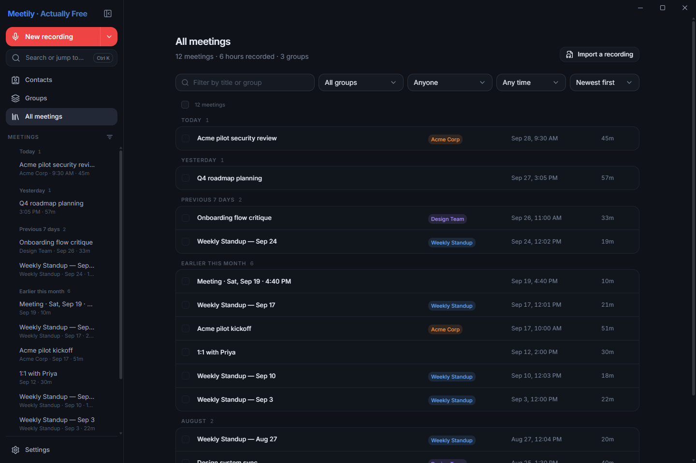

# Meetily - Actually Free

<p align="center">
  
</p>

**Know who said what—during this meeting and, optionally, the next.**

A free, local-first meeting recorder and workspace, built on
[Meetily](https://github.com/Zackriya-Solutions/meetily). This fork unlocks the app's
features without an account, license key, trial, or paid app tier. It puts
speaker-aware transcripts at the center of recording, notes, and follow-up.

**What sets this fork apart**

- **Speaker diarization:** see *when* different people spoke. Your microphone
  stays labeled **You**; on-device speaker models distinguish remote voices.
  Rename or merge speakers live or afterward, with optional Nemotron-3 for
  live labeling and post-call refinement.
- **Remember voices across meetings (beta):** opt in to local voice profiles,
  explicitly teach the app a named contact's voice from a recorded meeting,
  and get suggested names in later meetings. Matching needs clean audio and
  can be wrong—it is not proof of someone's identity.
- **More control, still local-first:** capture selected apps, revisit
  speaker-colored transcripts alongside audio, and keep notes, action items,
  and summaries in one workspace. No account or paid tier required.

[Download Windows](https://github.com/TylerBuza/Meetily-ActuallyFree/releases/latest)
· [macOS Apple Silicon preview](https://github.com/TylerBuza/Meetily-ActuallyFree/releases/tag/v0.2.21-macos)
· [Release notes](https://github.com/TylerBuza/Meetily-ActuallyFree/releases)
· [Report an issue](https://github.com/TylerBuza/Meetily-ActuallyFree/issues)

## Interface

Follow a live conversation, organize your meetings, and work with transcripts,
notes, and summaries in one workspace. Choose from three themes: **Midnight**,
**Vanilla**, and **Charcoal**.

Screenshots use demo meetings and simulated recording.

### Transcript, notes, action items, and summary in one workspace

<p align="center">
  
</p>

<details>
<summary><strong>See the live recording screen and meeting library</strong></summary>

### Live recording

<p align="center">
  
</p>

### Meeting library

<p align="center">
  
</p>

</details>

## What you can do

Current source builds add YAML frontmatter and an optional Obsidian link style
for named speakers. Other export formats keep their existing formatting.

Local transcription, live speaker editing, organized meeting notes, flexible AI
providers, and optional Labs features—all without a paid app tier.

<details>
<summary><strong>Record and transcribe locally</strong></summary>

- Capture microphone and computer audio with separate mute, volume, and level
  controls. Keep using the workspace during a call, or shrink to the floating
  recording bar.
- Transcribe live with **Parakeet** or a configured transcription engine. Use
  **Whisper** for optional post-call enhancement independently of the live model.
- Retain microphone and system tracks alongside mixed playback audio, so
  overlapping sources can be processed separately.
- Refine the transcript after a call while continuing to use the meeting page;
  progress stays in a compact, nonblocking card.
- Watch the system-audio level and **Low audio** advisory, and adjust gain yourself.
- Choose specific applications instead of all computer audio: Windows supports
  a multi-app whitelist; macOS currently supports one selected application.
- Use Whisper vocabulary hints for recurring names, acronyms, and meeting terms.

</details>

<details>
<summary><strong>Follow and identify speakers</strong></summary>

- Keep microphone speech identified as **You**, with remote speakers labeled
  separately. Rename and merge speakers during a call and edit labels afterward.
- Choose optional **Nemotron-3** for live remote-speaker labeling and post-call
  refinement. Nemotron uses **Auto-detect**; model speaker numbers are not a
  person's identity.
- Associate named speakers with contacts and see consistent person colors across
  transcripts and meeting pages.

</details>

<details>
<summary><strong>Work with your meetings</strong></summary>

- Read a speaker-colored, chat-style transcript and jump to audio from a line's
  timestamp. Keep notes, action items, and the AI summary beside the conversation.
- Organize meetings into groups, browse contacts and their meetings, and track
  action items with owners and due dates.
- Search meetings, transcripts, summaries, groups, people, and action items from
  the **Ctrl+K command bar**.
- Export one or multiple meetings to **PDF, Word, Markdown, text, or JSON**.
- Generate useful meeting titles from summaries, with manual names taking priority.

</details>

<details>
<summary><strong>Choose how AI runs</strong></summary>

- Use local summary models or connect a supported provider with your own API key.
- Use the **Claude Code CLI** summary provider with your installed `claude`
  command and existing sign-in. External providers retain their own access and
  billing requirements; the app adds no subscription requirement.
- Ask questions about meetings and use custom summary templates.
- Download optional models in the background during setup. Nemotron enables
  after a successful download; optional Whisper is configured for post-call use.

</details>

<details>
<summary><strong>Explore optional Labs features</strong></summary>

Settings → **Labs** contains opt-in, experimental capabilities:

- **Meeting automation:** on supported Windows meeting-detection signals,
  automatically start and stop recordings owned by the automation.
- **Waveform scrubbing:** navigate audio visually, with additional slower
  playback speeds.
- **Clean transcript:** switch between Clean and Verbatim views and use cleaned
  text for new summaries.
- **Whisper silence guard:** stricter silence/noise handling for Whisper.
- **Parakeet GPU:** run the encoder through DirectML on Windows.
- **Voice profiles (beta):** explicitly remember a named contact's voice from
  recorded system audio for suggested names in later meetings. Opt-in matching
  is experimental and depends on clean speech; review names before trusting them.

</details>

## Download and setup

Windows and macOS downloads are released separately. Check each
[release's notes](https://github.com/TylerBuza/Meetily-ActuallyFree/releases) for
the features and platform qualifications included in that build.

<details>
<summary><strong>Windows setup</strong></summary>

1. Download `Meetily-ActuallyFree-*-universal-setup.exe` from the
   [latest published release](https://github.com/TylerBuza/Meetily-ActuallyFree/releases/latest).
2. Run setup. The universal installer chooses **NVIDIA CUDA, Vulkan, or CPU** and
   includes the required runtimes.
3. Complete first-launch model setup and select your microphone/audio source.
   Optional downloads can continue in the background; recording needs a ready
   transcription model.

Windows 10/11 x64 is supported. Windows installers are not Authenticode-signed,
so SmartScreen may show **Unknown publisher**. Release downloads include SHA-256
checksums; the Windows updater payload has a separate cryptographic signature.

</details>

<details>
<summary><strong>macOS Apple Silicon preview setup</strong></summary>

1. Download the Apple Silicon `.dmg` from the
[macOS release](https://github.com/TylerBuza/Meetily-ActuallyFree/releases/tag/v0.2.21-macos).
2. Open the DMG and drag **Meetily - Actually Free** into Applications.
3. Grant microphone and Audio Capture permissions when prompted.

Requires an **M1 or newer Mac running macOS 14.2 Sonoma or later**. The DMG is
not notarized; first launch may require **Privacy & Security → Open Anyway**. This separate
preview passed automated packaging/launch checks, with physical macOS capture
qualification still pending. See the [macOS release runbook](.github/workflows/MACOS_RELEASE.md).

</details>

## Your data and model choices

Recordings, the meeting database, and downloaded models are stored locally.
Local inference can run without sending meeting content to a cloud model;
choosing a cloud provider or Claude CLI changes where that provider processes
the content. Model downloads and optional update checks require network access.
Analytics transmission is disabled, and Windows update checks are opt-in.

<details>
<summary><strong>Storage locations and saved audio files</strong></summary>

| Data | Location |
| --- | --- |
| Database, templates, and models | Windows/Linux: `<app folder>/data` when writable, with an OS data-directory fallback; macOS: `~/Library/Application Support/Meetily` |
| Recording/onboarding preferences | Tauri's application-data store; macOS: `~/Library/Application Support/com.meetily.ai` |
| Default recordings folder | Windows: `Music/meetily-recordings`; macOS: `Movies/meetily-recordings` |
| Saved audio tracks | `audio.mp4` (mixed playback), `mic.mp4`, and `system.mp4` |

Change the recordings folder in **Settings → Recording → Save Location**.
The meeting database, models, and preferences are distinct from the audio folder;
copying recordings alone does not move the entire workspace.

</details>

## Build and contribute

Start with the [development map](docs/DEVELOPMENT_MAP.md),
[architecture notes](ARCHITECTURE.md), and [contributor conventions](AGENTS.md).

<details>
<summary><strong>Build commands</strong></summary>

The desktop app uses **React/Next.js** in a **Tauri 2** WebView. **Rust** owns
capture, transcription, diarization, local storage, and AI orchestration. No
separate application server is required.

Windows prerequisites: Rust, Node.js/pnpm, Visual Studio 2022 Build Tools with
C++, CMake, and LLVM/libclang. GPU builds also need the corresponding SDK/toolkit.

```powershell
cd frontend
pnpm install
pnpm run tauri:dev:cpu
```

Universal Windows packaging:

```powershell
cd frontend
.\scripts\build-universal-windows.ps1 -AllowUnsigned
```

Validate the resulting Windows package from the repository root:

```powershell
node frontend/scripts/verify-windows-release.mjs
```

Apple Silicon builds must run on macOS with Rust, Node.js/pnpm, and Xcode command
line tools:

```bash
cd frontend
pnpm install
./scripts/build-macos-apple-silicon.sh
```

</details>

## Credits and license

Maintained by **[Tyler Buza (@TylerBuza)](https://github.com/TylerBuza)**, based on the original
[Meetily](https://github.com/Zackriya-Solutions/meetily) project by Zackriya Solutions.

MIT licensed. See [LICENSE.md](LICENSE.md). Original copyright notices and license
terms are retained.
